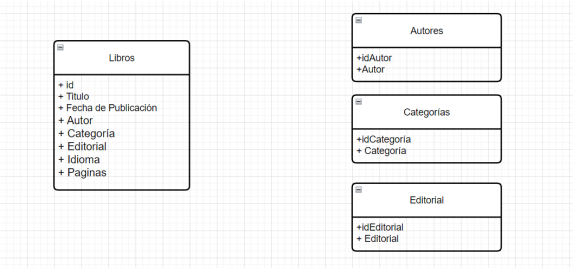

# Proyecto Práctico API RESTful

Este proyecto es una API RESTful que gestiona una base de datos de libros, autores, categorías y editoriales. La API permite realizar operaciones CRUD y consultas específicas sobre los datos.

## Características

- **Operaciones CRUD** para las siguientes entidades:

  - Libros
  - Autores
  - Categorías
  - Editoriales

- **Consultas específicas**:
  - Obtener todos los libros de un autor específico.
  - Obtener todos los libros de una categoría específica.
  - Obtener todos los libros de una editorial específica.
  - Obtener la lista de autores que han publicado en una categoría específica.

## Diseño de Base de Datos

La base de datos consta de las siguientes tablas:

1. **Libros**:

   - ID
   - Título
   - Autor_ID (relación con tabla Autores)
   - Categoría_ID (relación con tabla Categorías)
   - Editorial_ID (relación con tabla Editorial)

2. **Autores**:

   - ID
   - Nombre

3. **Categorías**:

   - ID
   - Nombre

4. **Editorial**:
   - ID
   - Nombre

## Endpoints

### Libros

- **GET /libros**: Obtener todos los libros.
- **GET /libros/{id}**: Obtener un libro por su ID.
- **POST /libros**: Crear un nuevo libro.
- **PUT /libros/{id}**: Actualizar un libro existente.
- **DELETE /libros/{id}**: Eliminar un libro.

### Autores

- **GET /autores**: Obtener todos los autores.
- **GET /autores/{id}**: Obtener un autor por su ID.
- **POST /autores**: Crear un nuevo autor.
- **PUT /autores/{id}**: Actualizar un autor existente.
- **DELETE /autores/{id}**: Eliminar un autor.

### Categorías

- **GET /categorias**: Obtener todas las categorías.
- **GET /categorias/{id}**: Obtener una categoría por su ID.
- **POST /categorias**: Crear una nueva categoría.
- **PUT /categorias/{id}**: Actualizar una categoría existente.
- **DELETE /categorias/{id}**: Eliminar una categoría.

### Editoriales

- **GET /editoriales**: Obtener todas las editoriales.
- **GET /editoriales/{id}**: Obtener una editorial por su ID.
- **POST /editoriales**: Crear una nueva editorial.
- **PUT /editoriales/{id}**: Actualizar una editorial existente.
- **DELETE /editoriales/{id}**: Eliminar una editorial.

### Consultas Específicas

- **GET /libros/autor/{autorId}**: Obtener todos los libros de un autor específico.
- **GET /libros/categoria/{categoriaId}**: Obtener todos los libros de una categoría específica.
- **GET /libros/editorial/{editorialId}**: Obtener todos los libros de una editorial específica.
- **GET /autores/categoria/{categoriaId}**: Obtener la lista de autores que han publicado en una categoría específica.

## Diagrama de la bd



## Instalación y Ejecución

1. Clona el repositorio:
   ```bash
   git clone https://github.com/usuario/proyecto-api-restful.git
   ```
2. Importa el archivo biblioteca.sql en bd mysql

3. Ejecuta el comando
   ```bash
   python manage.py runserver
   ```
4. Andate a la ruta para probar los endpoints
   ```bash
   http://127.0.0.1:8000/api
   ```
